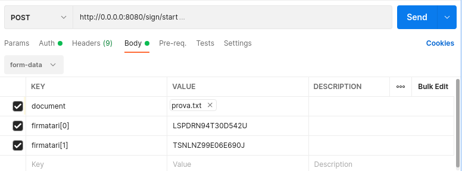

# Progetto_PA_Sopranzetti_Tiseni
## Obiettivo di progetto
L'obiettivo del progetto è di realizzare un sistema che consenta di gestire il processo di creazione e firma di documenti mediante openssl. In particolare, il back-end deve consentire di compiere le seguenti operazioni (tutte autenticate con un token JWT):
- Creare per un utente, se non esiste, un certificato prelevando i valori per la creazione dello stesso direttamente dal token JWT utilizzato per l'autenticazione.
- Invalidare un certificato associato all'utente.
- Richiedere la firma di un documento che viene inviato al back-end. Si deve prevedere sia una firma singolo utente che multi utente.
- Annullare un dato processo di firma. In questo caso solo chi ha avviano il processo lo può terminare.
- Chiedere lo stato del processo di firma. Anche in questo caso solo chi ha avviato il processo lo può terminare.
- Ottenere il file firmato (p7m). Solo chi partecipa al processo di firma può scaricare il file.
- Per ogni richiesta andata a buon fine viene scalato un credito pari a k token con k uguale al numero di partecipanti al processo di firma. In questo caso, la richiesta di firma deve essere rifiuatata se il numero di token non è sufficiente, resitutento all'utente 401 Unauthorized.
- Restituire il credito residuo di un utente.
- Un utente con il ruolo di admin deve poter ricaricare i token di un utente fornendo la mail e il nuovo "credito".

### Alcuni dettagli
- In generale, il token JWT utilizzato per utenticare tutte le richieste è sempre il medesimo e contiene un payload JSON con i seguenti campi:

  -	commonName=Adriano Mancini
  -	countryName=IT
  -	stateOrProvinceName=FM
  -	localityName=Fermo
  -	organizationName=ACME
  -	organizationalUnitName=IT
  -	emailAddress=demo@mailinator.com
  -	serialNumber=MNCDRN82T30D542U
  -	dnQualifier=20175007693
  -	SN=Mancini 
  -	role=user

  Per gli utenti admin nel campoo role ci sarà scritto "admin" invece che "user".

- Nel momento in cui si verifica il numero di token di un utente, ovvero quando esso chiede di avviare un nuovo processo di firma, nel conteggio si fa riferimento anche al numero di token "impegnati" dell'utente. Ovvero quei token che l'utente potrebbe utilizzare in futuro qualora dei processi di firma che esso aveva già avviato andassero a buon fine. Questo serve ad evitare che un utente possa avviare più processi di firma di quanti se ne può effittavamente permettere una volta che saranno completati.
 
- Per ogni utente, nel caso di firma multipla, viene utilizzata sempre la stessa PEMPASSPHRASE, ovvero la stessa password. Questo viene fatto perché openssl non prevede un comando che consenta di inserire più password nel caso di firme multiple.


## Progettazione

### Diagramma dei casi d'uso

Per rappresentare in maniera schematica tutte le richieste e gli obiettivi di progetto si è prodotto un diagramma dei casi d'uso.


Per ognuno di questi casi si sono definite, dunque, delle rotte nell'applicazione.
#### Rotte

Le rotte dell'applicazione sono state definite nel seguente modo:

| Rotta        | Metodo | Funzione  |
| ------------- | ------------- | ----- |
| / | GET | Benvenuto |
| /create | GET | Creare un proprio certificato |
| /invalidate | GET | Invalidare un certificato associato all'utente |
| /credit | GET | Visualizzare il credito residuo |
| /download/:id | GET | Ottenere il file firmato |
| /sign/start | POST | Iniziare un processo di firma |
| /sign/cancel/:id | GET | Annullare il processo di firma |
| /sign/status/:id | GET | Chiedere lo stato del processo di firma |
| /sign/getchallnumbers | GET | Recuperare i challenging codes |
| /sign/:id | POST | Firmare un documento |
| /admin/refill | POST | Aggiornamento dei token di un utente|

- Rotta: **/**

Questa rotta ha semplicemente il compito di inviare un messaggio di benvenuto all'utente.

- Rotta: **/create**

Rotta dedicata al processo di creazione di un nuovo certificato. All'utente sarà necessario fare una richiesta a questa rotta, dopo aver impostato correttamente il proprio token JWT, per creare un proprio certificato nell'applicazione. Tutti i dati per crearlo, infatti, sono recuperati direttamente dal token come da specifiche.

Qualora la creazione del messaggio andasse a buon fine all'utente viene tornato un messaggio che conferma la corretta creazione del certificato.

- Rotta: **/invalidate**

Un utente può utilizzare questa rotta per invalidare il proprio certificato, qualora ne abbia uno. Anche in questo caso è sufficiente invocare la rotta con il proprio token JWT per invalidare il proprio certificato.

Se l'invalidazione va a buon fine viene tornato all'utente un messaggio che ne certifica e conferma l'invalidazione. Una volta che un utente ha invalidato il proprio certificato potrà sempre crearne un altro in futuro.

- Rotta: **/credit**

L'utente può, in questo modo, visualizzare il proprio credito residuo in token. Basta chiamare questa rotta dopo aver impostato il proprio token JWT. 

All'utente verrà ritornato il numero di token rimanenti.

- Rotta: **/download/:id**

Si utilizza per scaricare un determinato documento del quale è terminato il processo di firma. Si deve indicare nella rotta l'id del documento stesso, che viene tornato all'utente ogni volta che si avvia un nuovo processo di firma. Come per le altre rotte, le informazioni riguardanti l'identità dell'utente che sta richiedendo il documento vengono recuperate direttamente dal token JWT.

- Rotta: **/sign/start**
  
Consente di avviare un nuovo processo di firma. Affiché questa rotta funzioni correttamente l'utente deve indicare nel body della richiesta: un campo contenente il documento da caricare sul server, provvisto di estenzione, avente come chiave la parola "document", e altri campi, sotto forma di array, contenenti i codici fiscali dei firmatari del documento.



Se la richiesta va a buon fine all'utente viene ritornato un messaggio di conferma e l'id del documento del quale si è avviato il processo. Questo id sarà necessario per tutte le altre rotta che lo richiedono.

Si sottolinea come la richiesta che deve essere effettuata all'applicazione deve essere di tipo "*multipart/form-data*". Questa scelta è stata fatta perché rende molto più semplice l'upload di file rispetto all'utilizzo di un body in JSON.

- Rotta: **/sign/cancel/:id**

Permette di terminare un determinato processo di firma il cui id viene indicato nella rotta. Si sottolinea come l'id del processo di firma sia lo stesso del documento al quale quel processo fa riferimento, la separazione fra i due è solo concettuale. 

Cancellare un processo di firma permette di eliminare tutte le informazioni sui firmatari e sul documento dal database dell'applicazione eliminando anche il documento stesso dal server.

Nel caso in cui la cancellazione andasse a buon fine viene ritornato un messaggio di conferma all'utente.

- Rotta: **/sign/status/:id**

Questa rotta può essere utilizzata per recuperare informazioni sulla stato di un processo di firma. 

Nella rotta si deve indicare l'id del processo di firma voluto.

All'utente che effettua la richiesta vengono ritornate una serie di informazioni che contengono, per ogni firmatario, il codice fiscale dello stesso e un campo che indica se quel firmatario ha già apposto la firma o meno.

- Rotta: **/sign/getchallnumbers**

Chiamando questa rotta vengono ritornati all'utente i challenging codes per effettuare successivamente la firma. I challenging codes hanno una durata di due minuti. L'utente viene identificato dall'applicazione mendiante le informazioni nel token JWT.

- Rotta: **/sign/:id**

Consente di firmare un determinato documento indicandone l'id nella rotta.

Nel body della richiesta vanno indicati i challenging codes che devono essere stati richiesti in precedenza mediante la rotta apposita. Il body deve essere un JSON formattato nel seguente modo:

```JSON
{
  "codes":[
    "af",
    "bc"
  ]
}
```
E si deve inserire all'interno dei codes i challenging codes che sono stati tornati dalla rotta apposita

Nel caso in cui il processo di firma andasse a buon fine viene ritornato all'utente un messaggio che conferma l'avvenuta firma. 

- Rotta: **/admin/refill**

Questa è la rotta dell'admin che consente di cambiare i token associato a un utente.

Per fare la richiesta è necessario che nel token JWT sia impostato come ruolo "admin" e che nel body della richiesta vengano inseriti la mail dell'utente del quale si vogliono modificare i token formattati nel seguente modo: 

```JSON
{
    "email": "demo@mailinator.com",
    "nToken": 10
}
```

### Diagramma delle classi

Per ogni macro elemento dell'applicazione è stato costruito un diagramma delle classi per rappresentarne schematicamente la struttura. 

Legenda:
- Giallo: in giallo sono colorati tutti quegli elementi che non rappresentano una classe ma rappresentano un modulo typescript.
- Blu: sono delle classi vere e proprie
- Rosa: in rosa sono colorate le interfacce 

#### Node server base


In questa parte di applicazione sono presenti tre elementi:
- [index.ts](https://github.com/S1107327/Progetto_PA_Sopranzetti_Tiseni/blob/main/src/index.ts): è il modulo che crea il server express e si occupa, principalmente, di gestire gli errori di mal-formattazione dei payload json, e di indicare all'applicazione di utilizzare i router in maniera corretta.
- [route.ts](https://github.com/S1107327/Progetto_PA_Sopranzetti_Tiseni/blob/main/src/route.ts): è il modulo che gestisce, attraverso un router, tutte le rotte dell'applicazione che non concernono il processo di firma.
- [route-sign.ts](https://github.com/S1107327/Progetto_PA_Sopranzetti_Tiseni/blob/main/src/route-sign.ts): è il modulo che gestisce, attraverso un router, tutte le rotte dell'applicazione per il processo di firma. 

#### Controller

I controller dell'applicazione sono:
- [Controller](https://github.com/S1107327/Progetto_PA_Sopranzetti_Tiseni/blob/main/src/controllers/Controller.ts): è la classe padre di tutti i controller e contiene i campi "readRepo" e "repo" che sono dei riferimenti alle repository, utili per tutte le operazioni che richiedono interazioni con i database.
- [AdminController](https://github.com/S1107327/Progetto_PA_Sopranzetti_Tiseni/blob/main/src/controllers/AdminController.ts): classe che identifica il controller per l'admin, essa contiene il metodo per cambiare i token di un determinato utente.
- [SignController](https://github.com/S1107327/Progetto_PA_Sopranzetti_Tiseni/blob/main/src/controllers/SignController.ts): è il controller che si occupa di gestire tutte le oprazioni riguardanti la firma o il processo di firma di un documento.
- [UserController](https://github.com/S1107327/Progetto_PA_Sopranzetti_Tiseni/blob/main/src/controllers/UserController.ts): è il controller per l'utente base e contiene al suo interno diverse operazioni che l'utente può compiere, escludendo quelle per il processo di firma che si trovano nel controller dedicato.

#### Database

Nella parte che si relaziona con il database sono presenti i seguenti elementi:
- [connection.ts](https://github.com/S1107327/Progetto_PA_Sopranzetti_Tiseni/blob/main/src/database/connection.ts): è il modulo che si occupa di fare la connessione al database attraverso "sequelize" indicando tutti i parametri necessari.
- [SignProcess](https://github.com/S1107327/Progetto_PA_Sopranzetti_Tiseni/blob/main/src/database/Models/DAOs/signProcessDAO.ts): è un DAO costrutito attraverso le funzionalità fornite da sequelize che mappa la tabella del database contenente i processi di firma.
- [User](https://github.com/S1107327/Progetto_PA_Sopranzetti_Tiseni/blob/main/src/database/Models/DAOs/userDAO.ts): DAO costruito attraverso sequelize che mappa la tabella del database contenente gli utenti.
- [Document](https://github.com/S1107327/Progetto_PA_Sopranzetti_Tiseni/blob/main/src/database/Models/DAOs/documentDAO.ts): DAO costruito attraverso sequelize che mappa la tabella del database contenente le informazioni sui documenti. 
- [IReadRepository](https://github.com/S1107327/Progetto_PA_Sopranzetti_Tiseni/blob/main/src/database/Models/readRepositoryInterface.ts): è l'interfaccia della repository che contiene tutte le operazioni di lettura sul database.
- [IRepository](https://github.com/S1107327/Progetto_PA_Sopranzetti_Tiseni/blob/main/src/database/Models/repositoryInterface.ts): è l'interfaccia della repository che contiene le operazioni di scrittura sul database.
- [readRepository](https://github.com/S1107327/Progetto_PA_Sopranzetti_Tiseni/blob/main/src/database/Models/readRepository.ts): è la classe che implementa la corrispondente interfaccia. Questa classe è costruita in maniera tale da essere un singleton, infatti è previsto un metodo "getRepo()" per poter accedere all'unica istanza della classe.
- [Repository](https://github.com/S1107327/Progetto_PA_Sopranzetti_Tiseni/blob/main/src/database/Models/repository.ts): anche questa è una classe singletone che implementa la corrispondente interfaccia.

Entrambe queste repository fanno uso di tutti e tre i DAO descritti per intervenire sul database in maniera rapida ed efficiente.


#### Errori


Il modulo contenente tutti gli errori dell'applicazione presenta:
- [error-factory.ts](): è il modulo che contiene la factory vera e propria degli errori attraverso la quale è possibili recuperare la giusta istanza del giusto errore quando necessario.
- [error-messages.ts](): modulo contenente tutti i messaggi degli errori personalizzati dell'applicazione. Tutte queste stringhe sono state racchiuse in un unico modulo per renderne più facile l'individuazione e l'eventuale modifica.
- [ErrorMsg](): è l'interfaccia comune a tutti gli errori personalizzati dell'applicazione. Essa contiene due attributi "status" e "message". Il primo indica lo status code dal ritornare al client, mentre il secondo il messaggio di errore da ritornare al client.
- [GenericError](): è l'errore più generale tra quelli realizzati. GenericError estende "Error" ovvero l'errore più generale di Typescript. Questa classe si occupa di impostare lo status code e il messaggio da tornare al client, nel caso in cui non venga passato nulla al costruttore, verrà automaticamente impostato un messaggio di default e uno status code 500.

Tra gli altri errori presenti, alcuni di essi estendono direttamente GenericError cambiandone messaggio e status code, alcuni esempi sono: "NotFound", "Forbidden". Altri invece, essendo errori a "livello più basso" estendono a loro volta errorri come "NotFound" o "Forbidden" andandone a cambiare solamente il messaggio di errore ma non lo status code, alcuni esempi sono: "InvalidEmail", InvalidId" o "CertAlreadyExistError".

L'intera gerarchia e struttura degli errori è visibile nell'immagine.


### Diagrammi delle sequenze

Per ogni rotta dell'applicazione, ad eccezione di quella di bevenuto, è stato definito un diagramma delle sequenze che spiega cosa accade internamente e quali sono le componenti attraversate dalla richiesta.


PER OGNI DIAGRAMMA SI SPIEGA COSA ACCADE E QUALI CONTROLLI SI SONO IMPLEMENTATI IN OGNI MIDDLEWARE

COSA FA IL CONTROLLER

### Pattern

## Utilizzo

### Prerequisiti

### Setup (non so se serve)

### Avviare l'applicazione

## Testing

TEST CON COLLEZIONE POSTMAN
METODO PER TESTARE DOWNLOAD DEL FILE 


